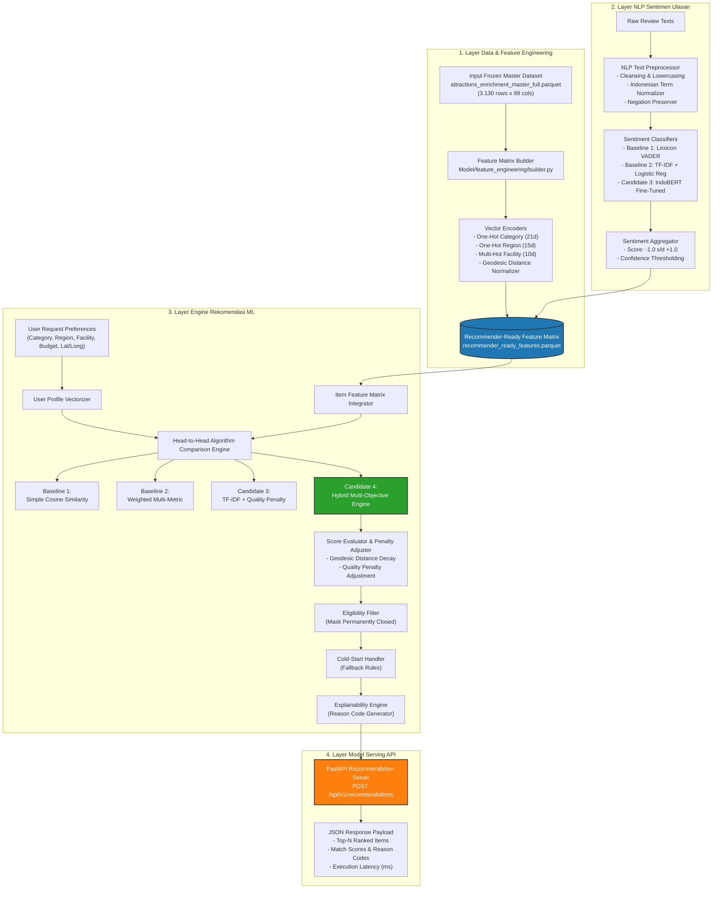
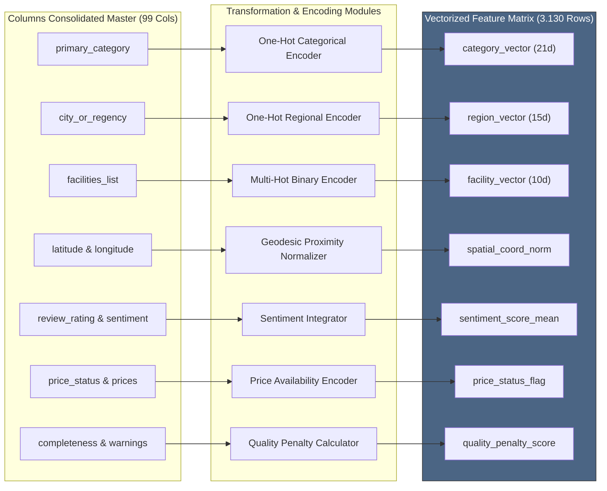
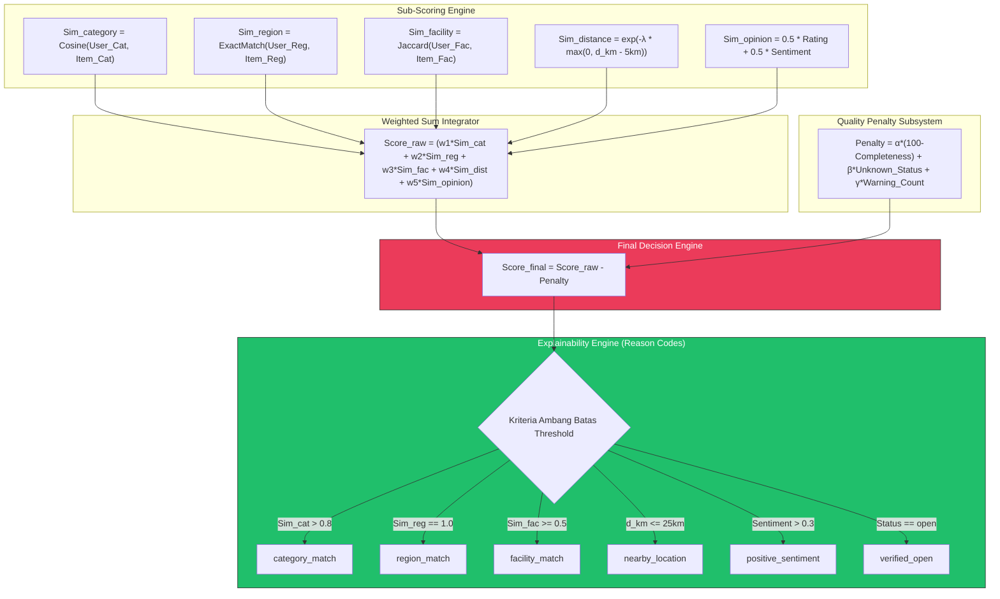

# Cetak Biru Arsitektur Model & Rencana Pengujian Performa (Benchmark Plan)
# Recommendation Traveller Lampung

| Informasi Arsitektur | Keterangan Teknis |
| :--- | :--- |
| **Nama Dokumen** | Cetak Biru Arsitektur Model ML & Benchmarking Plan |
| **Modul Terkait** | `Model/` (`feature_engineering/`, `recommender/`, `sentiment/`, `api/`) |
| **Versi Spesifikasi** | 1.0 (Pre-Implementation Baseline Architecture) |
| **Status** | Approved Blueprint |
| **Tanggal** | 29 Juli 2026 |
| **Dataset Sumber** | `Data/consolidated/attractions_enrichment_master_full.parquet` (3.130 records) |
| **Fokus Utama** | Desain Dataset, Preprocessing, Algoritma Pembanding & Evaluasi Performa |

---

## 1. Pendahuluan & Filosofi Perancangan Arsitektur

Dokumen ini mendefinisikan **arsitektur teknis menyeluruh** untuk pengembangan *Machine Learning Engine* sistem **Recommendation Traveller Lampung** sebelum penulisan kode *training/inference* dilakukan. 

### Prinsip Utama Perancangan:
1. **Model-Agnostic & Multi-Algorithm Comparison**: Sistem dirancang agar dapat membandingkan beberapa pendekatan algoritma (*Baseline* vs *Candidate Models*) secara adil (*head-to-head benchmarking*) berdasarkan metrik performa objektif.
2. **Reproduosibilitas & Zero Data Leakage**: Seluruh pengolahan fitur menggunakan dataset terisolasi berbasis *frozen dataset* (`consolidated-enrichment-master-full-v1`) dengan *random seed* ter-lock.
3. **Pemisahan Modul Secara Ketat**: Preprocessing, Feature Matrix, Engine Rekomendasi, NLP Sentimen, dan Service API diisolasi pada direktori masing-masing untuk memudahkan pengujian.

---

## 2. Visualisasi Pipeline Arsitektur Sistem ML (End-to-End Diagram)

Berikut adalah diagram alur visualisasi sistem dari pengolahan dataset mentah hingga penyajian rekomendasi melalui REST API:

---

## 3. Visualisasi Pipeline Feature Engineering & Vektorasi Fitur

Diagram berikut menggambarkan transformasi terperinci dari 99 kolom *Consolidated Master* menjadi matriks vektor numerik ML:

---

## 4. Visualisasi Algoritma Scoring & Explainability Engine

Diagram berikut menunjukkan bagaimana *Hybrid Multi-Objective Scoring Model* (Candidate 4) menghitung kecocokan destinasi dan meng-generate *Reason Codes*:

---

## 5. Matriks Algoritma Rekomendasi yang Akan Dibandingkan (*Recommender Benchmarking*)

Untuk menentukan model rekomendasi terbaik, kita akan mengimplementasikan dan membandingkan **4 Algoritma Pembanding**:

| ID Algoritma | Nama Algoritma | Mekanisme & Formulir Matematika | Kelebihan & Alasan Pembandingan |
| :--- | :--- | :--- | :--- |
| **Baseline 1** | **Simple Cosine Similarity** | Membandingkan Vektor Profil Pengguna dan Vektor Fitur Destinasi menggunakan standard Cosine Similarity: $$Sim(\vec{U}, \vec{I}) = \frac{\vec{U} \cdot \vec{I}}{\|\vec{U}\| \|\vec{I}\|}$$ | Algoritma dasar yang cepat dan sederhana sebagai *benchmark* minimal. |
| **Baseline 2** | **Weighted Multi-Metric Similarity** | Menggabungkan Cosine Similarity Kategori ($Sim_{cat}$), Jaccard Similarity Fasilitas ($Sim_{fac}$), dan One-Hot Region Matching ($Sim_{reg}$): $$Score = w_1 Sim_{cat} + w_2 Sim_{reg} + w_3 Sim_{fac}$$ | Memisahkan perhitungan kategorikal dan biner untuk kecocokan fasilitas yang lebih presisi. |
| **Candidate 3** | **TF-IDF Feature Similarity + Quality Penalty** | Membentuk *textual representation* dari destinasi (Kategori + Wilayah + Fasilitas + Status Harga), menghitung TF-IDF Vector Similarity, dan menguranginya dengan Penalti Kualitas: $$Score = Cosine(TFIDF_U, TFIDF_I) - Penalty_{quality}$$ | Mengukur efektifitas pendekatan representasi teks terstruktur vs One-Hot murni. |
| **Candidate 4** | **Hybrid Multi-Objective Scoring (Rekomendasi Utama)** | Mengintegrasikan seluruh aspek (Similarity Kategori/Wilayah/Fasilitas, Geodesic Distance Decay, Integrasi Sentimen Ulasan, dan Quality Penalty): $$Score_{final} = w_1 Sim_{cat} + w_2 Sim_{reg} + w_3 Sim_{fac} + w_4 Sim_{dist} + w_5 Sim_{opinion} - Penalty_{quality}$$ | Algoritma komprehensif yang dirancang khusus sesuai spesifikasi SRS. |

---

## 6. Matriks Algoritma Analisis Sentimen NLP yang Akan Dibandingkan (*Sentiment Benchmarking*)

Untuk pengolahan teks ulasan pengunjung, kita akan mengimplementasikan dan membandingkan **3 Pendekatan Model NLP**:

| ID Algoritma | Nama Model Sentimen | Deskripsi Teknis Pipeline NLP | Target Metrik |
| :--- | :--- | :--- | :--- |
| **Baseline 1** | **Lexicon-Based Analyzer** | Menggunakan kamus kata positif/negatif Bahasa Indonesia (VADER/InaLexicon) untuk menghitung polarity score tanpa pelatihan model. | Memerlukan 0 data latih, cepat, tetapi kurang memahami konteks lokal/gaul. |
| **Baseline 2** | **TF-IDF + Logistic Regression / SVM** | Preprocessing teks ulasan (cleansing, lowercasing, stopword removal) $\rightarrow$ Ekstraksi Fitur TF-IDF (N-gram 1-2) $\rightarrow$ Classifier supervised. | Model Machine Learning klasik yang stabil, efisien, dan ringan diproses. |
| **Candidate 3** | **Fine-Tuned IndoBERT** | Fine-tuning model Transformer pretrained Bahasa Indonesia (`indobenchmark/indobert-base-p1`) pada 3 kelas (`positive`, `neutral`, `negative`). | Menangkap konteks kalimat kompleks, negasi, dan ekspresi ulasan wisata secara mendalam. |

---

## 7. Strategi Evaluasi Performa & Metrik Pengujian (*Evaluation Plan*)

### 7.1 Evaluasi Model Rekomendasi (*Recommender Evaluation Metrics*)
Pengujian performa algoritma rekomendasi dilakukan menggunakan skenario pengujian preferensi (*synthetic/benchmark test cases*) dengan metrik:

1. **Precision@K ($P@K$)**: Persentase destinasi relevan dalam $K$ item rekomendasi teratas.
   $$P@K = \frac{|\text{Item Relevan dalam Top-}K|}{K}$$
2. **Recall@K ($R@K$)**: Persentase destinasi relevan yang berhasil direkomendasikan dari seluruh item relevan.
3. **nDCG@K (Normalized Discounted Cumulative Gain)**: Mengukur kualitas peringkat rekomendasi dengan memberikan bobot lebih tinggi pada item relevan di posisi teratas.
4. **Catalog Coverage**: Persentase total destinasi unik dari 3.130 tempat yang pernah muncul dalam rekomendasi:
   $$Coverage = \frac{|\bigcup_{u \in U} R_u|}{3.130} \times 100\%$$
5. **Regional & Category Diversity**: Mengukur keberagaman variasi kabupaten/kota dan kategori dalam hasil *Top-N*.
6. **Inference Latency (ms)**: Waktu komputasi yang dibutuhkan algoritma untuk menghasilkan rekomendasi dari 3.130 baris data.

### 7.2 Evaluasi Model Sentimen NLP (*Sentiment Evaluation Metrics*)
1. **Accuracy**: Persentase total prediksi sentimen yang benar.
2. **Macro F1-Score**: Rata-rata F1-score lintas 3 kelas (Positif, Netral, Negatif) untuk menangani ketidakseimbangan kelas (*imbalanced data*).
3. **Confusion Matrix**: Matriks visualisasi *True Positive*, *False Positive*, *True Negative*, dan *False Negative*.
